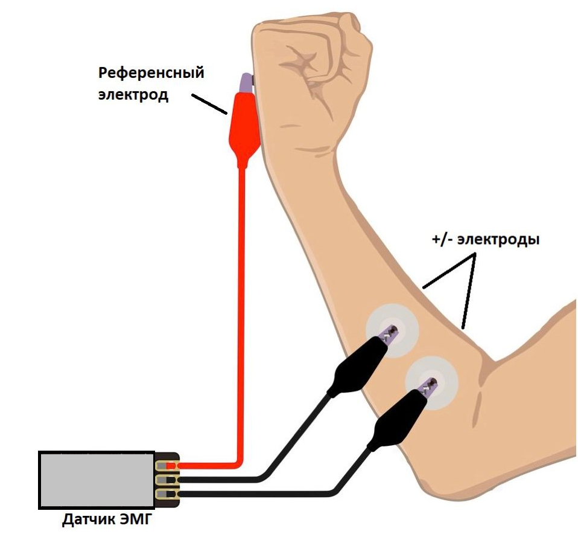
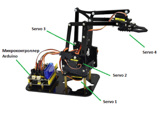
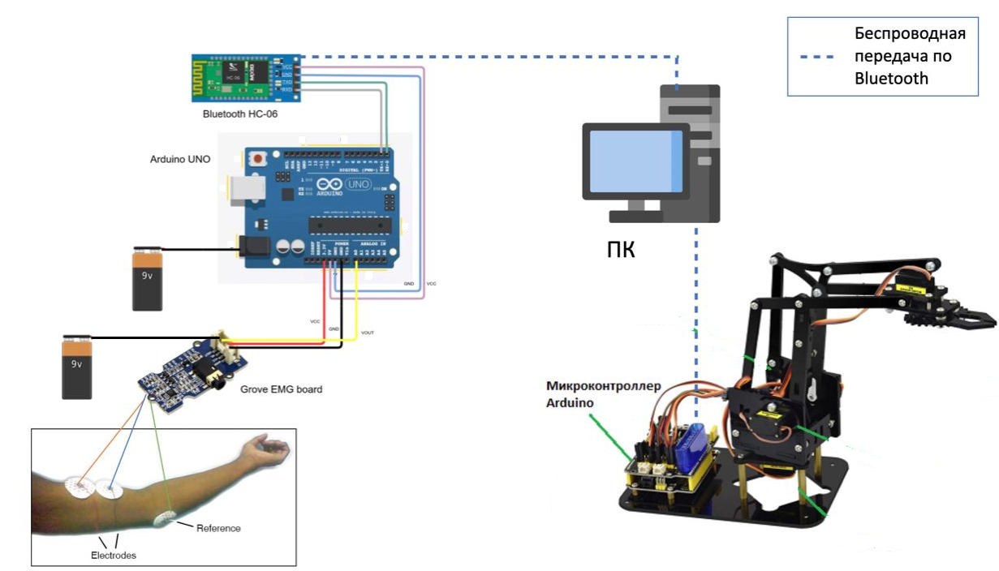

В качестве оборудования для сбора данных был использован поверхностный ЭМГ датчик Muscle Sensor V3, подключенный к микроконтроллеру Arduino Uno R3 (рисунок 1). К датчику по проводу подключены три электрода: положительной полярности, отрицательной полярности и референсный. Положительный и отрицательный электроды крепятся непосредственно вдоль мышцы для снятия разности потенциалов напряжения. Референсный электрод выполняет роль заземления сигнала и для удобства пользователя крепится на электрически нейтральной ткани, такую как поверхность локтевого сустава, основание запястья, коленной чашечки и т.д. Также на поверхность электродов рекомендуется наносить специальный электролитический гель для улучшения контакта с кожей. Первичная обработка и передача данных происходит на стороне микроконтроллера. Данные передаются на ПК для дальнейшей работы с помощью Bluetooth-модуля HC-06.

Рисунок 1 – Схема подключения электродов
В качестве роботизированного устройства использовался манипулятор Ks0198 keyestudio 4DOF Robot Mechanical Arm Kit for Arduino DIY (роботизированное устройство) [32], состоящий из 4-х сервоприводов Black 180° Servo, которые и выполняют полученные команды в реальном времени. Сервопривод способен выполнять вращение маховика по часовой и против часовой стрелки. Таким образом, манипулятор способен выполнять в общем до 8-ми движений. Каждый сервопривод интегрирован в конструкцию манипулятора и отвечает за каждое отдельное движение, как показано далее (рисунок 2).

Рисунок 2 – Схема подключения подсистемы управления МРУ [32]
Servo 1 отвечает за вращение платформы – влево/вправо;
Servo 2 отвечает за движение руки манипулятора – вперед/назад;
Servo 3 отвечает за движение руки манипулятора – вверх/вниз;
Servo 4 отвечает за движение клешни – открытие/закрытие.
Манипулятор подключен ко второму микроконтроллеру Arduino Uno R3, который также имеет встроенный API для интерпретации команд, приходящих с ПК с помощью подключенного Bluetooth-модуля HC-06. Таким образом, разработанная система имеет полностью беспроводную передачу данных.
Таким образом, была спроектирована схема аппаратного обеспечения (рисунок 3). 

Рисунок 3 – Схема аппаратного обеспечения
В качестве языка программирования для разработки ПО был выбран Python, так как он дает широкий выбор использования библиотек для работы с алгоритмами и моделями машинного обучения, а также для эффективной работы с большим объемом данных. Для работы с алгоритмами кластеризации и классификации была использована библиотека Scikit-learn [26]. Для разработки модуля обработки ЭМГ сигналов использована библиотека python Scipy [33]. Для разработки модуля отбора признаков были применены методы из библиотеки Feature-engine [34]. Для работы с большими массивами данных использовались библиотеки pandas и numpy [35, 36]. В качестве среды разработки использовалась Pycharm: Community edition.
Arduino предоставляет специализированный API для разработки программ на стороне микроконтроллера - Arduino Software (IDE). Набор библиотек и файлов с исходным кодом реализованы на языке C. Передача данных между микроконтроллером и ПК производится с помощью последовательного порта Serial, который выступает в качестве единого выходного буфера для всех данных, которые можно получить с микроконтроллера.